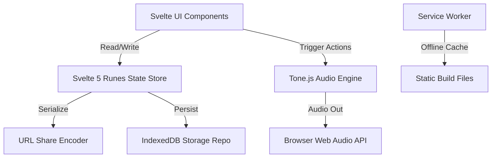

# System Architecture - KoalaFi

## Structural Topology

KoalaFi is structured as a client-side Single Page Application (SPA) powered by SvelteKit, compiled via `@sveltejs/adapter-static` for static hosting.

## Architectural Boundaries

### 1. State Domain (`src/lib/state/`)

- Contains the central serializable state definitions, default parameters, built-in presets, and Svelte 5 runes-based global reactive stores.
- Runes-based `$state` proxies nested changes reactively to the layout.

### 2. Share Domain (`src/lib/share/`)

- Serializes states into short URL-safe Base64 strings.
- Decodes incoming URLs, validating parameters to prevent app crashes.
- Computes rough-clock offset times from UTC start dates.

### 3. Storage Domain (`src/lib/storage/`)

- Manages local persistence utilizing IndexedDB, wrapped in `idb`.
- Decouples raw IndexedDB calls into structured repositories: presets, settings, and recently played logs.

### 4. Audio Domain (`src/lib/audio/`)

- Encapsulates Tone.js synthesizers, effects, scheduling loops, and seeded random calculations.
- Exposes a unified API (`koalaFiEngine`) to prevent UI components from mutating global transport and synth states.

### 5. Visual Domain (`src/lib/visuals/`)

- High-performance animated outrun sunset visuals rendered on a Canvas 2D frame-capped loop.
- Monitors document visibility and user system preferences (reduced motion) to prevent CPU/battery drain.
