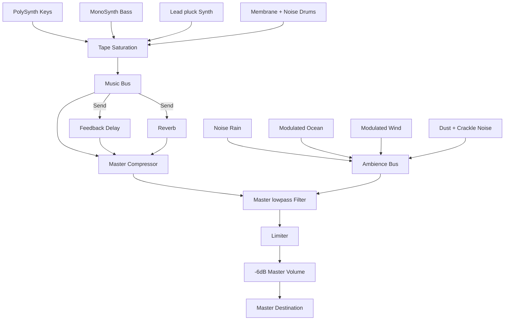

# Audio Engine Specification - KoalaFi

## Audio Pipeline & Routing

All audio in KoalaFi is synthesized procedurally inside the browser using **Tone.js**. The master bus includes compression, a warm lowpass filter, a limiter, and a conservative output volume.

## Synthesizers & Elements

### 1. Rhodes Chords (PolySynth)

- Sine waves passed through a lowpass filter.
- Warm envelopes: slow attack (150ms) and release (1.8s) to simulate vintage electric pianos.
- Warmth is modulated by cozy levels, which lower the filter cutoff frequency.
- **Tape Wow & Flutter**: A slow LFO (`Tone.LFO` modulating `synth.detune` by ±7 cents at 0.12Hz) adds gentle analog pitch drift.
- **Comping Playback**: Scheduled using soft comping stabs and repeats instead of continuous pads to create rhythmic breathing room.

### 2. Sub Bass (MonoSynth)

- Triangle oscillator playing deep notes (octave 2).
- Warm envelope: slow attack (180ms) for a gentle sub swell on note start.
- Clean lowpass envelope to emphasize fundamental warmth while avoiding muddiness.
- **Grooving Playback**: Plays short notes (duration `'4n'` or `'8n'`) with rests instead of a solid drone.

### 3. Lead Pluck (Synth)

- Triangle lead with quick decay envelope.
- **Dynamic Filter Sweep**: A slow LFO (0.07Hz) modulates the lowpass filter cutoff by ±150Hz.
- **Vibrato**: A slow LFO (0.18Hz) modulates `synth.detune` by ±8 cents.
- Routed heavily through the auxiliary delay and reverb channels.
- **Phrasing Playback**: Generates call-and-response phrases in 8-bar blocks (clamped velocities: core `0.35–0.55`, decorative `0.18–0.32`).

### 4. Drums

- **Kick**: Short pitch-sweep on a sine oscillator using a `MembraneSynth` (tight decay: 220ms, velocity scale: 0.85).
- **Snare**: Pink noise burst passed through a bandpass filter centered at 750Hz (Q: 0.8) for a dusty, soft clap.
- **Hi-hat**: Pink noise burst (softer and less tiring than white noise) passed through a highpass filter centered at 6500Hz.
- **Beat Patterns**: Scheduled on a 16-step grid with deterministic swing and velocity humanization.

### 5. Ambience

- **Ocean Waves**: Synced LFOs (0.05Hz) modulate both the volume (0.05 to 0.7) and the lowpass filter cutoff frequency (220Hz to 680Hz) to simulate wave swells.
- **Wind**: Slow LFO (0.035Hz) modulating the cutoff frequency of a warm (Q: 3) bandpass filter (200Hz to 480Hz) on brown noise.
- **Rain**: Soft lowpass (780Hz) pink noise rumble + gentle bandpass droplets (3200Hz, 15ms decay) triggered at irregular time intervals.
- **Vinyl**: Dust rumble (lowpass brown noise) + sparse crackle pops (pink noise, 4ms decay) scheduled on a quarter-note (`4n`) transport queue.

## Lifecycle & Mix Rules

- Audio starts only from a user gesture through `initializeAudio()`.
- UI code calls the engine facade; Tone.js globals and nodes stay inside `src/lib/audio`.
- All `Tone.LFO` instances are cleaned up correctly in the `dispose()` lifecycle.
- `applyState()` regenerates patterns when seed, generator version, key, or scale changes, then updates real-time levels, swing, and filters.
- `dispose()` clears scheduled transport parts before disposing instruments and effects.
- `Tone.start()` is guarded with a timeout so a blocked audio context does not leave the UI waiting forever.
- Volume adjustments are transitioned smoothly using `setTargetAtTime` to prevent sudden jumps, pops, or clicks.
