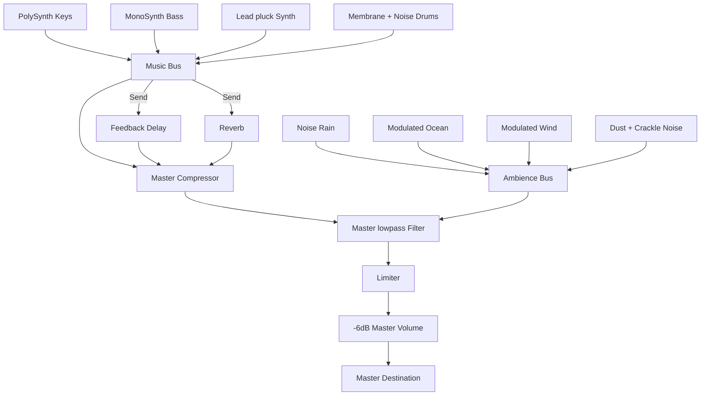

# Audio Engine Specification - KoalaFi

## Audio Pipeline & Routing

All audio in KoalaFi is synthesized procedurally inside the browser using **Tone.js**. The master bus includes compression, a warm lowpass filter, a limiter, and a conservative output volume.

## Synthesizers & Elements

### 1. Rhodes Chords (PolySynth)

- Sine waves passed through a lowpass filter.
- Soft envelopes: slow attack (120ms) and release (1.5s) to simulate vintage electric pianos.
- Warmth is modulated by cozy levels, which lower the filter cutoff frequency.

### 2. Sub Bass (MonoSynth)

- Triangle oscillator playing deep notes (octave 2).
- Clean lowpass envelope to emphasize fundamental warmth while avoiding muddiness.

### 3. Lead Pluck (Synth)

- Triangle lead with quick decay envelope.
- Routed heavily through the auxiliary delay and reverb channels.

### 4. Drums

- **Kick**: Short pitch-sweep on a sine oscillator using a `MembraneSynth`.
- **Snare**: Pink noise burst passed through a bandpass filter centered at 1000Hz.
- **Hi-hat**: White noise burst passed through a highpass filter centered at 8000Hz.

### 5. Ambience

- **Ocean Waves**: Slow LFO (0.07Hz) modulating the volume of pink noise.
- **Wind**: Slow LFO (0.04Hz) modulating the cutoff frequency of a high-resonance (Q: 5) bandpass filter on brown noise.
- **Rain**: Pink noise bandpass + micro high-pass clicks scheduled at irregular time intervals on a fast repeating tick.
- **Vinyl**: Dust rumble (lowpass brown noise) + crackle pops scheduled in the transport queue.

## Lifecycle Rules

- Audio starts only from a user gesture through `initializeAudio()`.
- UI code calls the engine facade; Tone.js globals and nodes stay inside `src/lib/audio`.
- `applyState()` regenerates patterns when seed, generator version, key, or scale changes, then updates real-time levels and filters.
- `dispose()` clears scheduled transport parts before disposing instruments and effects.
- `Tone.start()` is guarded with a timeout so a blocked audio context does not leave the UI waiting forever.
